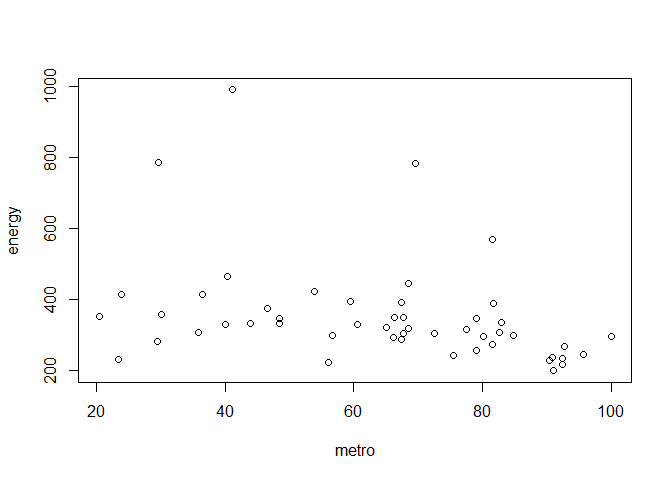
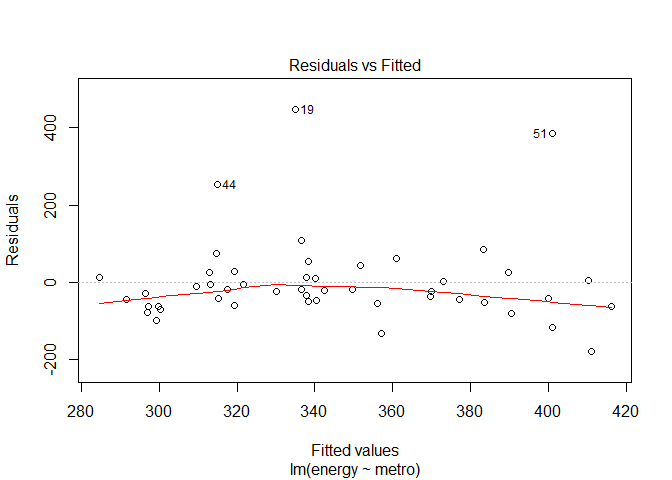
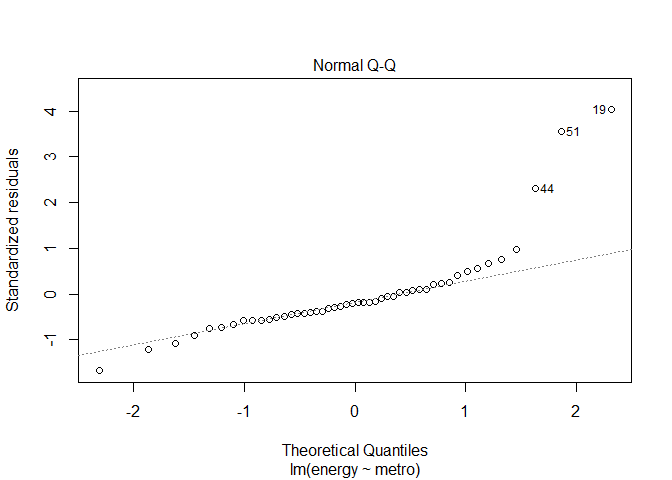
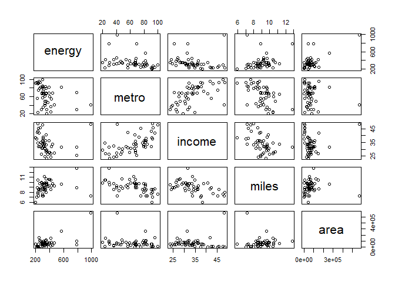
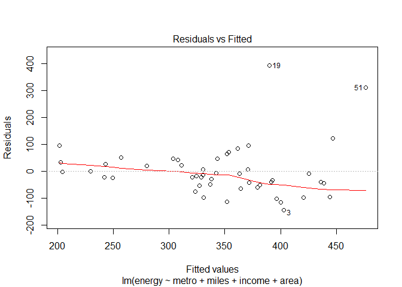
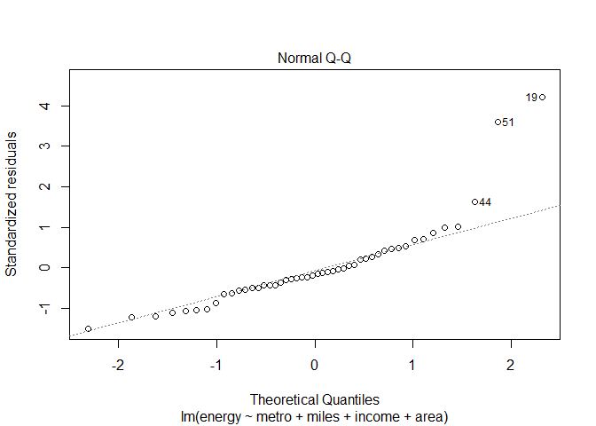

Least Squares Regression Excercise
================
Mashlahul Afif

Introduction
------------

This excercise is the first mini project in chapter 7.1 of Linear and Logistic's Regression, which is part of Springboard's Introduction to Data Science's Course's Curriculum.

------------------------------------------------------------------------

Problem Statement
-----------------

To fit a model predicting energy consumed per capita (energy) from the percentage of residents living in metropolitan areas (metro) using the states.rds data set, and do the following:

1.  Examine/plot the data before fitting the model
2.  Print and interpret the model \`summary'
3.  Plot the model to look for deviations from modeling assumptions
4.  Select one or more additional predictors to add to your model and repeat steps 1-3
5.  Check if the new model made in step no.4 above significantly better than the model with /metro/ as the only predictor.

------------------------------------------------------------------------

Solution
--------

### Preparation

Firstly, dataset is imported using the following command:

``` r
states.data <- readRDS("states.rds")
```

Then, all attributes for above datasets are listed as follow as reference:

``` r
states.info <- data.frame(attributes(states.data)[c("names", "var.labels")])
states.info
```

    ##      names                      var.labels
    ## 1    state                           State
    ## 2   region             Geographical region
    ## 3      pop                 1990 population
    ## 4     area         Land area, square miles
    ## 5  density          People per square mile
    ## 6    metro Metropolitan area population, %
    ## 7    waste    Per capita solid waste, tons
    ## 8   energy Per capita energy consumed, Btu
    ## 9    miles    Per capita miles/year, 1,000
    ## 10   toxic Per capita toxics released, lbs
    ## 11   green Per capita greenhouse gas, tons
    ## 12   house    House '91 environ. voting, %
    ## 13  senate   Senate '91 environ. voting, %
    ## 14    csat        Mean composite SAT score
    ## 15    vsat           Mean verbal SAT score
    ## 16    msat             Mean math SAT score
    ## 17 percent       % HS graduates taking SAT
    ## 18 expense Per pupil expenditures prim&sec
    ## 19  income Median household income, $1,000
    ## 20    high             % adults HS diploma
    ## 21 college         % adults college degree

------------------------------------------------------------------------

### Model 1 - Predicting Energy Consumption using Single Independent Variable

Model for predicting Energy consumption percapita from single independent variable of metropolitan area population will be developed in this first model.

Plot for the relation between metropolitan area population is as the following:

``` r
energycons1 <- subset(states.data, select=c("metro","energy")) 
plot(energycons1)
```



Next step will be to create and to examine the linear regression model as follow:

``` r
energycons1.model <- lm(energy ~ metro, data = na.omit(states.data))
energycons1.model.sum <- summary(energycons1.model)
energycons1.model.sum
```

    ## 
    ## Call:
    ## lm(formula = energy ~ metro, data = na.omit(states.data))
    ## 
    ## Residuals:
    ##     Min      1Q  Median      3Q     Max 
    ## -179.17  -54.21  -21.64   15.07  448.02 
    ## 
    ## Coefficients:
    ##             Estimate Std. Error t value Pr(>|t|)    
    ## (Intercept) 449.8382    50.4472   8.917 1.37e-11 ***
    ## metro        -1.6526     0.7428  -2.225    0.031 *  
    ## ---
    ## Signif. codes:  0 '***' 0.001 '**' 0.01 '*' 0.05 '.' 0.1 ' ' 1
    ## 
    ## Residual standard error: 112.3 on 46 degrees of freedom
    ## Multiple R-squared:  0.09714,    Adjusted R-squared:  0.07751 
    ## F-statistic: 4.949 on 1 and 46 DF,  p-value: 0.03105

From the summary above, it is obtained that the R-Squared for this model is 0.097141462625338, which shows that error from this first model is very high.

Next is to check whether this model fulfill the assumption of linear regression.

``` r
plot(energycons1.model, which = c(1,2))
```



From plots above, this first model actually fullfils the assumption of linear regression.

------------------------------------------------------------------------

### Model 2 Predicting Energy Consumption using Multiple Independent Variables

Other than metropolitan population precentage (metro), land area (area), medium house hold income (income), per capita miles/year (miles) will be added as the predictors.

First, is to observe the relation of each variables using plot.

``` r
energycons2 <- subset(states.data,select=c("energy","metro","income","miles","area"))
plot(energycons2)
```



Next is to create the new model using lm function and to examine the summary result

``` r
energycons2.model <- lm(energy ~  metro  + miles + income + area, data = na.omit(states.data))
energycons2.model.sum <- summary(energycons2.model)
energycons2.model.sum
```

    ## 
    ## Call:
    ## lm(formula = energy ~ metro + miles + income + area, data = na.omit(states.data))
    ## 
    ## Residuals:
    ##     Min      1Q  Median      3Q     Max 
    ## -145.14  -49.62  -17.02   33.75  392.75 
    ## 
    ## Coefficients:
    ##               Estimate Std. Error t value Pr(>|t|)  
    ## (Intercept)  1.506e+02  1.956e+02   0.770   0.4457  
    ## metro        9.290e-01  1.073e+00   0.866   0.3913  
    ## miles        3.872e+01  1.631e+01   2.374   0.0221 *
    ## income      -7.098e+00  3.517e+00  -2.018   0.0498 *
    ## area         2.758e-04  3.503e-04   0.787   0.4353  
    ## ---
    ## Signif. codes:  0 '***' 0.001 '**' 0.01 '*' 0.05 '.' 0.1 ' ' 1
    ## 
    ## Residual standard error: 100.2 on 43 degrees of freedom
    ## Multiple R-squared:  0.329,  Adjusted R-squared:  0.2666 
    ## F-statistic: 5.272 on 4 and 43 DF,  p-value: 0.001518

From the summary above, it is obtained that the R-Squared for this model is 0.329028616119962, which is better than the previous model of 0.097141462625338.

Next is to check quality of model 2 compared to model 1 with analysis of variance.

``` r
anv.model1.model2 <- anova(energycons1.model,energycons2.model)
anv.model1.model2
```

    ## Analysis of Variance Table
    ## 
    ## Model 1: energy ~ metro
    ## Model 2: energy ~ metro + miles + income + area
    ##   Res.Df    RSS Df Sum of Sq      F   Pr(>F)   
    ## 1     46 580411                                
    ## 2     43 431341  3    149071 4.9536 0.004841 **
    ## ---
    ## Signif. codes:  0 '***' 0.001 '**' 0.01 '*' 0.05 '.' 0.1 ' ' 1

Result of anova() analysis above shows that Pr(&gt;F) is equal to 0.00484113979685253. This Pr(&gt;F) value indicates that the new model is actually an improvement from the first model.

Lastly is to check if the model 2 fulfill the assumption of linear regression.

``` r
plot(energycons2.model, which = c(1,2))
```



From plots above, this second model also fullfils the assumption of linear regression.
